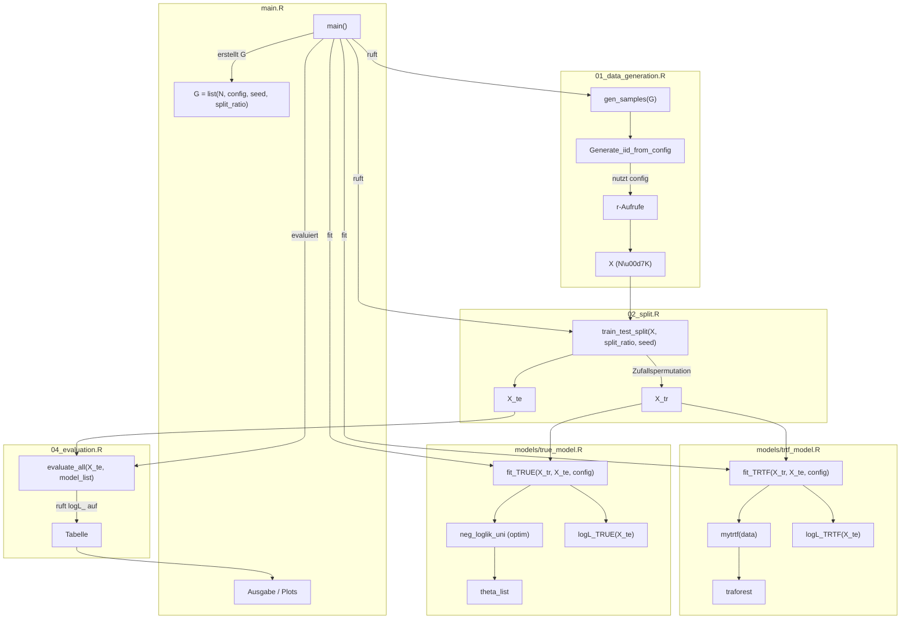

# Ablaufdiagramm der Skripte und Modelle

Das folgende Mermaid-Diagramm veranschaulicht die Interaktion der Skripte
`01_data_generation.R`, `02_split.R`, `04_evaluation.R` und `main.R` sowie der
zwei Modellimplementierungen **TRTF** und **TrueModel**. Alle Berechnungen der Log-Likelihood finden konsequent im
Log-Raum statt, wie in `README.md` beschrieben. Parameter, die strikt positiv
sein m\u00fcssen, werden \u00fcber `softplus()` transformiert.


```
