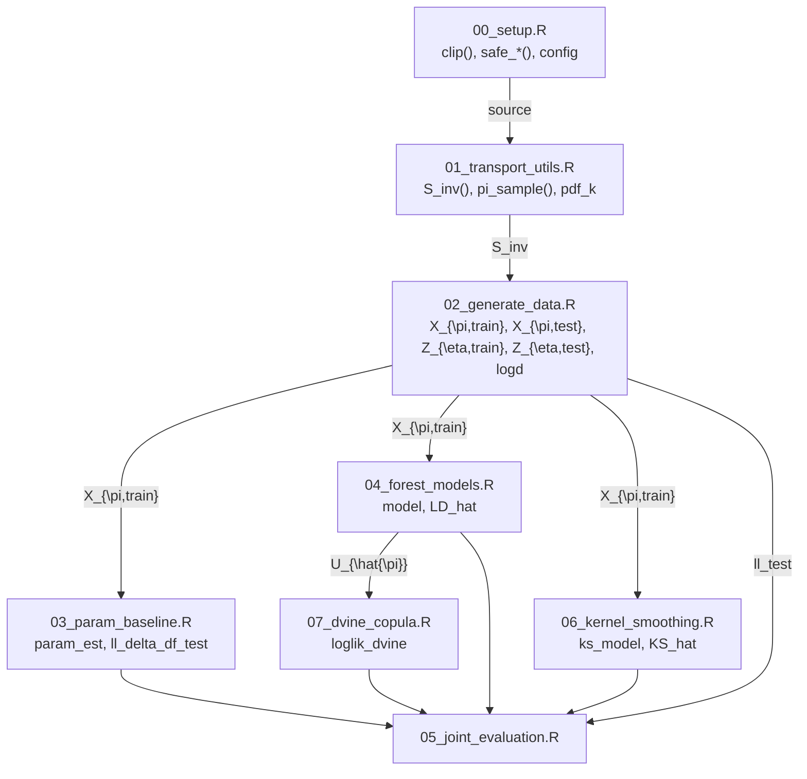

# Script Workflow

The following diagram details how the analysis scripts `00_setup.R` through `07_dvine_copula.R` interact when executed via `run_all.R`.  Boxes refer to scripts and arrow labels indicate which objects are passed.  All names follow [Notation.md](Notation.md).

Scripts are sourced in this order. `00_setup.R` defines numerical safeguards and the distribution list `config`. `01_transport_utils.R` constructs the triangular map via `S_inv()` and helper densities. `02_generate_data.R` draws samples from the target distribution, computes the log-determinant and stores CSV files. In `03_param_baseline.R` parametric log-likelihoods are fitted and compared to the truth, producing `ll_delta_df_test`. `04_forest_models.R` trains transformation forests and yields component log-density estimates `LD_hat`. `06_kernel_smoothing.R` implements a sequential kernel estimator `KS_hat`. Using the forest CDFs, `07_dvine_copula.R` fits a D-vine copula and outputs the joint log-likelihood `loglik_dvine`. Finally `05_joint_evaluation.R` gathers all log-likelihood contributions, writes diagnostics and aggregates them in `results/evaluation_summary.csv`.
