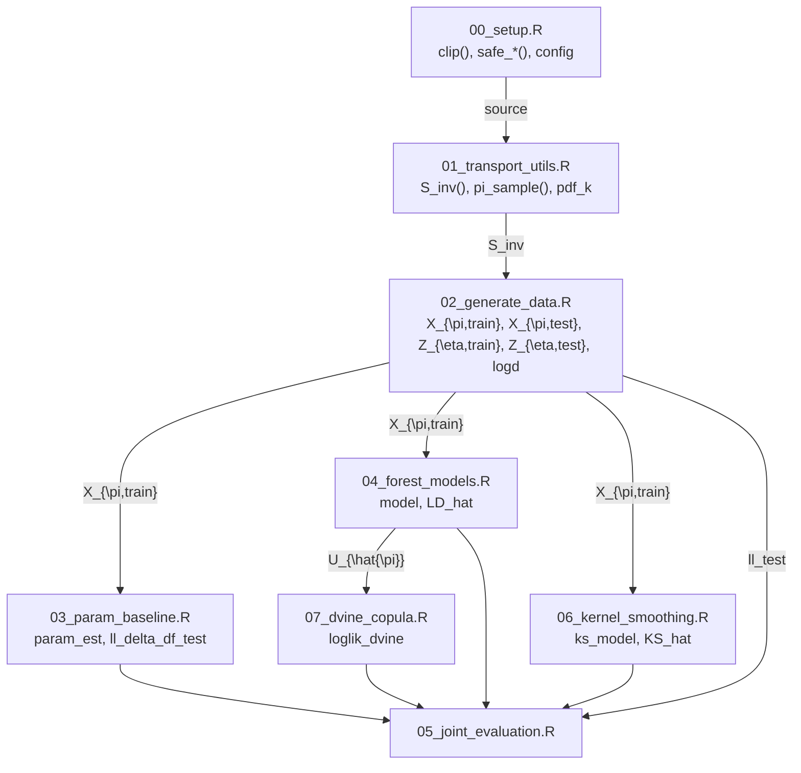

# Script Workflow

```mermaid
flowchart TD
    Setup["00_setup.R\nclip(), safe_*(), config"] -->|"source"| Utils["01_transport_utils.R\nS_inv(), pi_sample(), pdf_k" ]
    Utils -->|"S_inv"| Data["02_generate_data.R\nX_{\pi,train}, X_{\pi,test}, Z_{\eta,train}, Z_{\eta,test}, logd"]
    Data -->|"X_{\pi,train}"| Baseline["03_param_baseline.R\nparam_est, ll_delta_df_test"]
    Data -->|"X_{\pi,train}"| Forest["04_forest_models.R\nmodel, LD_hat"]
    Data -->|"X_{\pi,train}"| Kernel["06_kernel_smoothing.R\nks_model, KS_hat"]
    Forest -->|"U_{\hat{\pi}}"| Copula["07_dvine_copula.R\nloglik_dvine"]
    Data -->|"ll_test"| Eval["05_joint_evaluation.R"]
    Baseline --> Eval
    Forest --> Eval
    Kernel --> Eval
    Copula --> Eval
```

