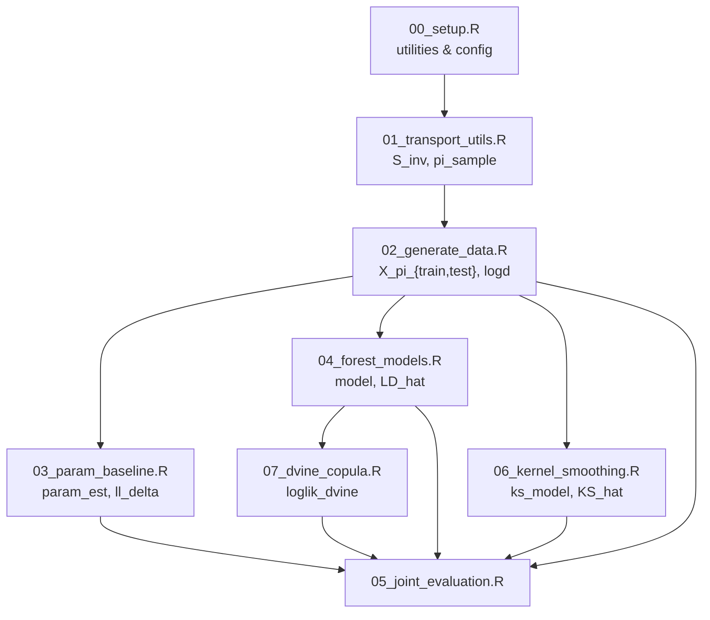

# Script Workflow

The diagram below summarises how the analysis scripts `00`--`07` interact when executed via `run_all.R`. Each box corresponds to a script and arrows indicate which objects are produced and consumed.

Running `run_all.R` sources the scripts in the order shown. `00_setup.R` loads packages and defines numerical safeguards together with the distribution `config`. `01_transport_utils.R` creates density and inversion functions used by `02_generate_data.R` to simulate training and test sets. From these data, `03_param_baseline.R` fits simple parametric models while `04_forest_models.R` trains transformation forests. `06_kernel_smoothing.R` applies sequential kernel density estimators. The D-vine copula in `07_dvine_copula.R` uses the conditional CDFs from the forest models. Finally, `05_joint_evaluation.R` aggregates log-likelihood comparisons and produces diagnostic plots.
