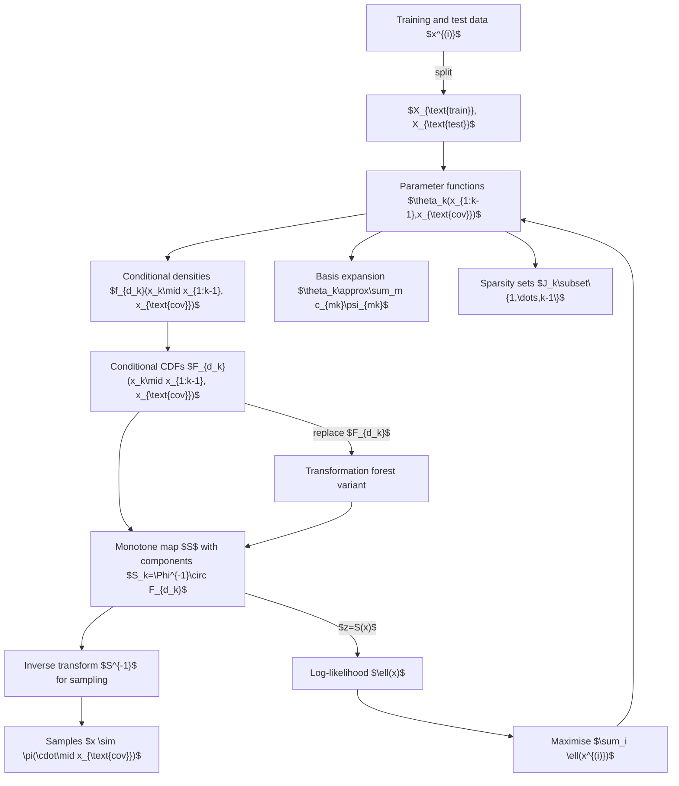

# Theory Workflow

The diagram below summarises the algorithmic structure implied by [Theory.md](Theory.md). Boxes represent mathematical objects or operations.

The workflow traces how data inform the parameter functions, which in turn define the conditional densities and the triangular transport map. Sampling uses the inverse map, while likelihood evaluation feeds back into parameter estimation. Basis expansions and sparsity restrict the parameter functions. A non-parametric alternative replaces the parametric CDFs by transformation forests.
