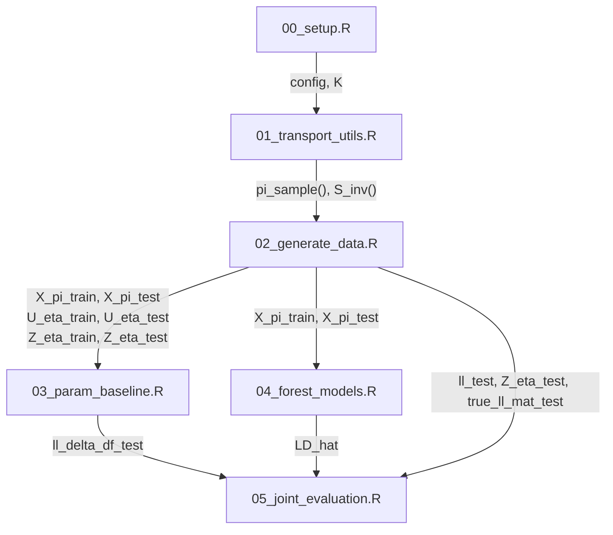

# Script Workflow

The following Mermaid diagram summarises how the main scripts interact. Each box denotes an R script. Arrows indicate which objects are passed forward.

This workflow mirrors `run_all.R`.  The setup script defines global constants, followed by utilities for the triangular transport map. Data generation draws from the reference distribution and transforms it into the target space. The parametric baseline and forest models fit conditional densities using the generated training data. Finally, the evaluation script compares the estimated densities against the true likelihood.
